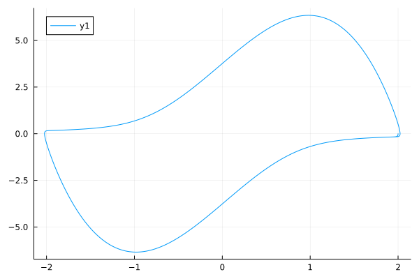

# Perioda limitnega cikla

V tokratni domači nalogi smo mogli poiskati periodo limitnega cikla za diferencialno enačbo

$x′′(t)−4(1−x^2)x′(t)+x=0$.

Na začetku smo definirali podatkovni tip `ZacetniProblemNDE`, ki predstavlja začetni problem navadne diferencialne enačbe. Nato smo definirali funkcijo, ki reši dano diferencialno enačbo z uporabo implicitne trapezne metode, ki uporablja definirano podatkovno strukturo. Torej funkcija `resi_trapez` poišče približek za rešitev diferencialne enačbe `y'(x)=f(x, y(x))` z začetnim pogojem `y(x0) = y0` na intervalu `[x0, xk]` z `n` koraki implicitne trapezne metode. S preizkušanjem različnih točk in risanjem grafa smo poskali začetni približek, in sicer `x0 = 2` in `y0 = 0`.

Potem smo dobljeni rezultat uporabili za iskanje periode funkcije. Tako da smo najprej z uporabo bisekcije izračunali ničle in nato izračunali periodo funkcije. Da bi dobili občutek danega limitnega cikla, na sliki lahko vidimo graf v fazni ravnini: 

